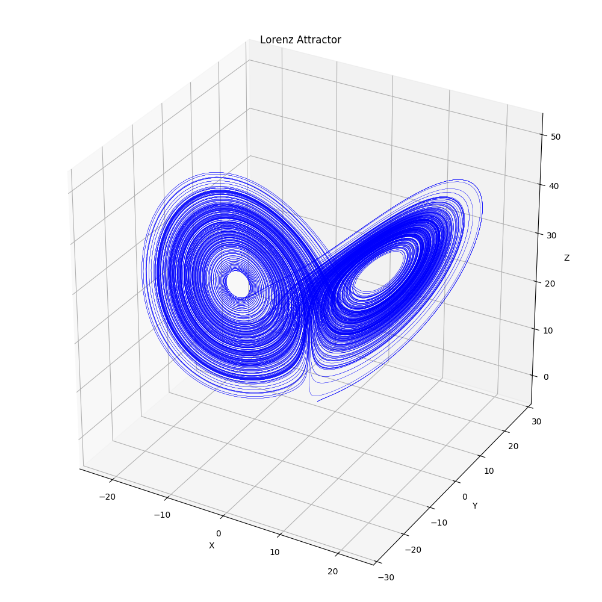

# Lorentz Attractor Solution Animation

Info: https://en.wikipedia.org/wiki/Lorenz_system

Static Example Image:


To run the simulation
 1. Download the repository.
 1. Navigate to repository directory
 1. (Optionally) generate data in **generate_data.ipynb** using jupyter. To do this, you need to have Cython installed. There is genereated data provided, **L_data.npy**.
 1. (Optionally) modify view settings in **Lorenz_Attractor.py**.
 1. Run **Lorenz_Attractor.py**:
 ```
 python 3 ~/path/to/Lorenz_Attractor.py
 ```
